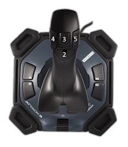
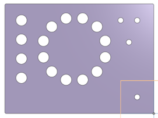
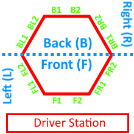
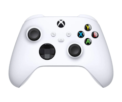

# FRC 1732 - Robot Controls

This page describes the control scheme for our FRC robotics team’s robot, including both the hardware layout and the various modes of operation.
---
## Hardware Overview

### Driver Controls
- **Two Logitech Attack 3 joysticks**
  - **Left joystick** (Joystick 1) handles robot translation.
  - **Right joystick** (Joystick 2) handles robot rotation.

### Operator Controls
- **Button panel** that includes various switches and buttons for advanced controls.

---
## Control Schemes

### Full Manual Control
- **Left Joystick** translates (moves) the robot.
- **Right Joystick** rotates the robot.

### Hybrid Control
In certain circumstances, the robot automatically handles orientation or alignment when a button is pressed:

1. **Intake Coral (Left Joystick Trigger)**
   - Holding this trigger will orient the robot to the nearest HP station for coral intake.
2. **Aim at Branch (Right Joystick Trigger)**
   - By default, holding this trigger automatically orients the robot to the nearest branch and locks sideways translation to align with that branch.
3. **Aim at Net (Left Joystick Button)**
   - Holding this button automatically orients the robot to the net.

### Full Autonomous Operation
- Engaged when the **full auto placement switch** on the operator panel is **enabled** **and** the **either joystick trigger (intake/score coral)** is held.
- If scoring coral, the robot automatically drives to the branch scoring location specified by the operator and places the coral.
- If intaking coral, the robot automatically dirves to the HP station that driver is pointing at with the tranlation joystick.

---
## Detailed Control Layout

### Joystick 1 (Left Joystick)
- **Axis X**: Translate Robot (horizontal)
- **Axis Y**: Translate Robot (vertical)
- **Button 1 (Trigger)**: Hold to intake coral (orients to the HP station the stick is pointing towards)
- **Button 2 (down)**: Hold to intake algae
- **Button 3 (up)**: Hold to aim at net

### Joystick 2 (Right Joystick)
- **Axis X**: Rotate Robot
- **Axis Y**: (Not specifically used in rotation mode)
- **Button 1 (Trigger)**: Hold to aim at selected branch for coral scoring - returns to HP pose on release
- **Button 2 (down)**: Hold to eject coral
- **Button 3 (up)**: Hold to eject algae
- **Button 4 (left)**: Hold to clear/remove algae from reef
- **Button 8**: Press to reset gyro and robot pose to F1

### Operator Panel
- **Button 1**: Hold to eject algae
- **Button 2**: Press to reset gyro and robot pose to F1
- **Button 3**: Press to extend climber
- **Button 4**: Hold to retract climber
- ~~- **Button 5**: Switch to Engage/disengage slow mode (max speed limited to 25%)~~
- **Button 6**: Set coral target height to 1
- **Button 7**: Set coral target height to 2
- **Button 8**: Set coral target height to 3
- **Button 9**: Set coral target height to 4
- **Button 10**: Set coral target to F1
- **Button 11**: Set coral target to F2
- **Button 12**: Set coral target to FR1
- **Button 13**: Set coral target to FR2
- **Button 14**: Set coral target to FL1
- **Button 15**: Set coral target to FL2
- **Button 16**: Set coral target to BR1
- **Button 17**: Set coral target to BR2
- **Button 18**: Set coral target to BL1
- **Button 19**: Set coral target to BL2
- **Button 20**: Set coral target to B1
- **Button 21**: Set coral target to B2
- ~~**Button 22**: Switch to set preferred coral target side to 1 or 2~~
- **Button 23**: Retract climber slowly switch
- **Button 24**: Hold to eject coral
- **Button 25**: Switch to set algae target to low or high
- **Button 26**: Switch to enable/disable full auto placement
- **Button 27**: Switch to enable/disable vision

---
## Scoring Targets Explanation

Each face of the scoring area is part of a hexagon, with two targets on each face. The faces are labeled:
- **Front (F)**
- **Front left (FL)**
- **Front Right (FR)**
- **Back Left (BL)**
- **Back Right (BR)**
- **Back (B)**

Additionally, the numbers (1 and 2) indicate different positions on each face. For F and B faces, `1` is on the left, for the others it is on the bottom.

In summary:
- **F** or **FR** or **FL** or **BR** or **BL** or **B** indicate which face.
- **1** or **2** indicates which position on that face.

---
## Xbox Controller Mapping
In case an Xbox controller is used instead of the two-joystick and panel layout:

- **Left Stick**: Translate Robot
- **Right Stick**: Rotate Robot
- **Left Trigger (LT)**: Hold to aim at branch (coral scoring)
- **Right Trigger (RT)**: Hold to intake coral
- **Left Bumper (LB)**: Hold to eject algae
- **Right Bumper (RB)**: Hold to intake algae
- **Button A**: Set coral target height to 2
- **Button B**: Set coral target height to 3
- **Button X**: _(Not assigned)_
- **Button Y**: Set coral target height to 4

